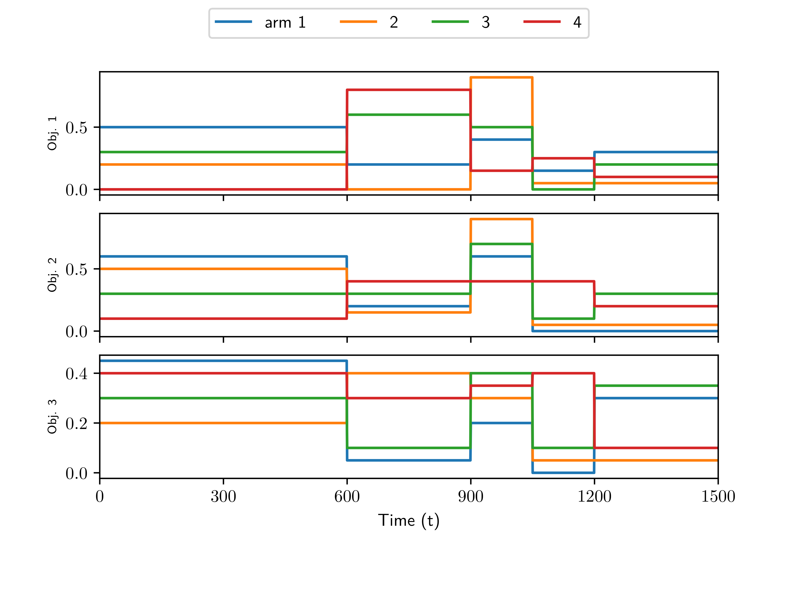
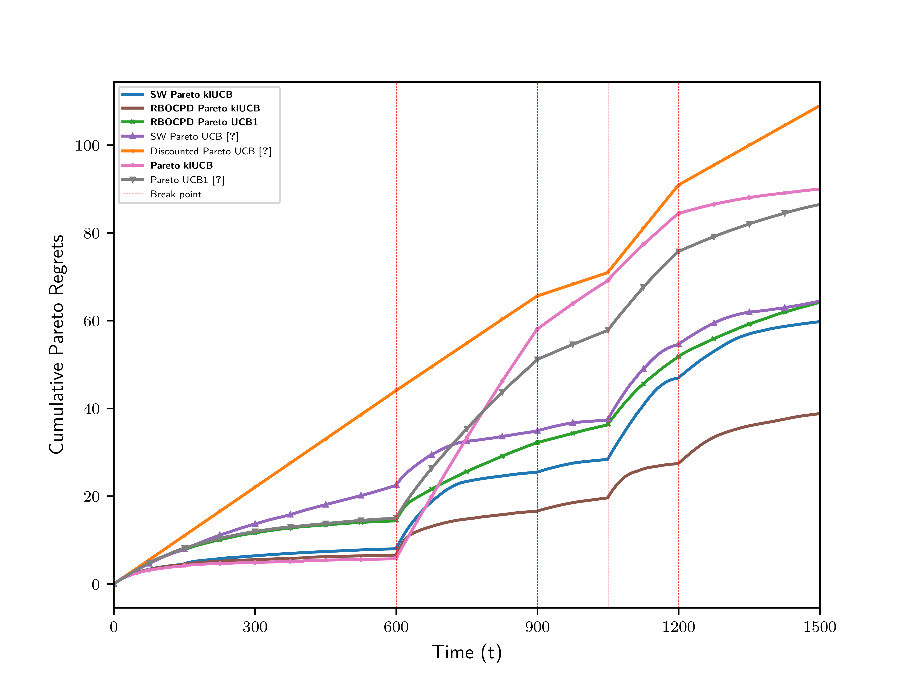

# PS_MOMAB

## Description
This is an implementation of the proposed algorithms in [Piecewise-Stationary Multi-Objective Multi-Armed Bandit with Application to Joint Communications and Sensing](https://arxiv.org/abs/2302.05257) and [Adaptive Energy-Efficient Waveform Design For Joint Communication and Sensing using Multiobjective Multiarmed Bandits](https://ieeexplore.ieee.org/document/10104580). These algorithms are UCB-based Multi-Objective Multi-Armed Bandit which can work in non-stationary environments. 

## How to Install:
```
# In project root folder
pip install -r requirements.txt
```
## How to Run:
The environment can be configured in the "config_synthetic.py" file of the root folder. You then can run the experiment and save the result by commands below:
```
# In project root folder
python ./run_synthetic.py
python ./plot_performances.py
```
## Result of the synthetic dataset
### Part 1
A plot of mean rewards over time.

### Part 2
A plot of cumulative pareto regrets over time (averaged over 100 runs each).


## References
- [Piecewise-Stationary Multi-Objective Multi-Armed Bandit with Application to Joint Communications and Sensing](https://arxiv.org/abs/2302.05257)
- [Adaptive Energy-Efficient Waveform Design For Joint Communication and Sensing using Multiobjective Multiarmed Bandits](https://ieeexplore.ieee.org/document/10104580)